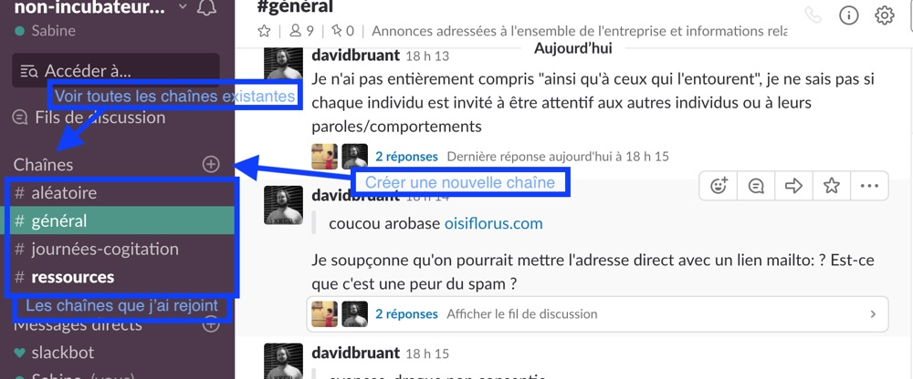

# Slack

## Pourquoi ce Slack ?
L'un des objets de Oisiflorus, c'est de rassembler des personnes qui :
- ont envie de faire, et/ou font déjà, des choses concrètes dans le domaine de l'écologie (donner de leur temps, énergie, expertise...)
- partagent certaines attentes, valeurs, comportements de groupe...
- sont dispersées à travers la France, voire à travers le monde.

Pour l'instant, ce Slack nous paraît être l'outil le plus adapté pour que ces personnes se "rencontrent", discutent, s'organisent, créent des projets...

## Inviter d'autres personnes
Tu peux inviter des personnes avec qui ça a du sens de discuter sur le Slack de Oisiflorus. Pour éviter d'avoir l'impression de discuter avec de parfait·e·s inconnu·e·s, ce serait plus sympa d'accompagner les nouveaux arrivant·e·s et de leurs proposer d'écrire un petite présentation sur la chaine : général.

### Présentation sur l'espace de documentation - (Github)
En tant que nouvelle personne et après t'être présenté·e sur la chaine -général- du slack, tu peux, toi aussi, avoir envie de faire connaissance avec les personnes impliquées dans Oisiflorus : 
http://www.oisiflorus.com/a-propos-de-nous/z-etes-qui.md

Si tu es à l'aise avec -Github- tu peux [ajouter ta propre présentation directement](https://github.com/oisiflorus/documentation/edit/master/a-propos-de-nous/z-etes-qui.md)

Ou demander à la personne qui t'accompagne de le faire avec toi.

### Accompagnat·eur·rice

Ce n'est pas toujours facile pour quelqu'un·e de rejoindre un groupe existant, et d'ailleurs ce n'est pas toujours évident pour un groupe d'acceuillir une nouvelle personne. Le rôle d'ccompagnat·eur·rice

## Paramétrage des notifications, ou comment ne pas subir Slack
Slack envoie certaines notifications par email par défaut. Selon si tu as installé l'application mobile et/ou le logiciel pour ordinateur, tu peux en recevoir d'autres.
Bonne nouvelle ! Tu peux complètement [paramétrer toutes ces notifications](https://get.slack.help/hc/fr-fr/articles/201355156-Guide-des-notifications-de-Slack-) pour ne pas te faire submerger.

## Code of Conduct
Dans le cadre de nos intéractions, chaque personne doit pouvoir se sentir en confiance.

Pour essayer de clarifier notre intention et aider les personnes impliquées à comprendre notre vision, nous avons rédiger un ["Code of Conduct"](http://www.oisiflorus.com/a-propos-de-nous/code-of-conduct.html) dont nous aimerions te conseiller la lecture.

## Rapport signal/bruit
Les discussions sur cet espace n'intéresseront généralement pas *chaque membre* à *chaque fois*.

**L'enjeu** est que ce Slack soit notre moyen de communication à tou.te.s, sans noyer personne sous des fils de discussion dont il ou elle n'a que faire...

### Les fils de discussion
Pour répondre à un message sans que tous les membres de la chaîne ne reçoivent une notification, nous recommandons d'utiliser sans modération les fils de discussion ;)

*Lire plus sur la doc officielle de Slack [ici](https://get.slack.help/hc/fr-fr/articles/115000769927-Fils-de-discussion-de-messages-et-de-fichiers)*

### Les chaînes
Lorsque certains sujets sont récurrents et n'intéressent pas forcément l'ensemble des membres, il est adapté de créer une chaîne dédiée. Les chaînes sont publiques et n'importe qui peut en créer une ou en rejoindre une.
Nous recommandons de poster sur la chaîne #Général l'information que l'on a créé une nouvelle chaîne (et de laisser les personnes décider de la rejoindre ou pas).

#### Présentation des chaines

- #Général : pour poster les infos qui concernent tout le monde et qui ne sont pas attachées à une chaine spécifique.
- #JournéesCofitation : Messages concernant les [journées du tour France](http://www.oisiflorus.com/journees-cogitation/journees-de-cogitation.html)
- #ressources : Tu as peut-être des liens vers des sites ou des ressources en PDF liés à Oisiflorus, c'est ici que tu peux les poster.
- #aléatoires : Pour éviter d'augmenter le rapport -signal/bruit- tu pourras poster tes billets d'humeur et d'humour sur cette chaine.
